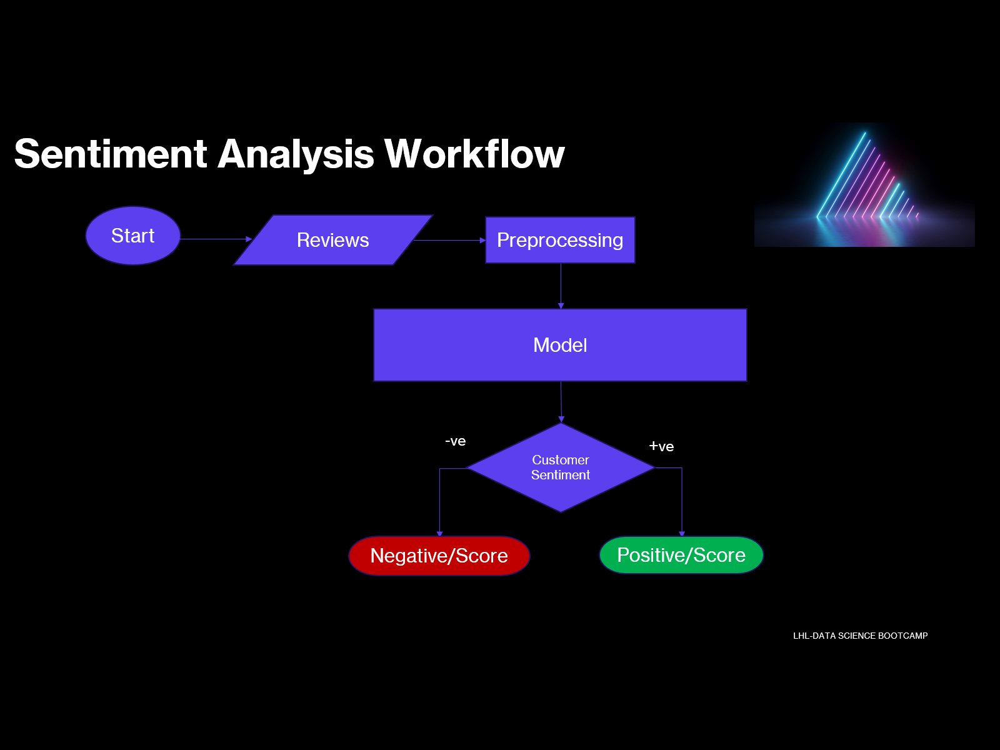

# Amazon Fine Food Review and Rating Score (Sentiment Analysis)

### Project Description:
In this project, we will apply Machine Learning Algorithms for sentiment analysis that means we predict the sentiment of the review given by the customer on the Food Products of Amazon.

## Process
### Exploring: 
I start with deep diving into data to get the better understanding of the dataset. I start exploring the each column of the table and try to be more familiar with it. For this I use capabilities of python to understand the data. I also use Excel as our dataset is in .csv format.

### Cleaning:
Then I start with the cleaning process. Initially we start with the easy going cleaning which are easy to detect and fix. For example eliminating NULL valued rows. Python is a great tool to do that in no-time.

### Workflow:

### Models Used :
I have used 4 pretrained models for prediction
- Juliensimon/reviews-sentiment-analysis
- Transformer Pipeline-sentiment-analysis
- VADER
- TextBlob

### Project Insites:
These models predict the sentiment label(Negative/Positive) along with the sentiment score range form (-1,1) to measure the positivity/negativity.
### Outcome:
I beleive this type of engineering could help the businesses to understand the customer experience and make the decisions accordingly.

### Future Goal:
- Try to Fine-Tune the pretrained models
- Like to train a model from scratch
- Want to analyse other domains as well like – tweets, comments, financial sentiments etc.

### Challenges:
- Unlabelled Data
- Understanding complex human emotions
- Sarcasm
- Need Resources and Time

